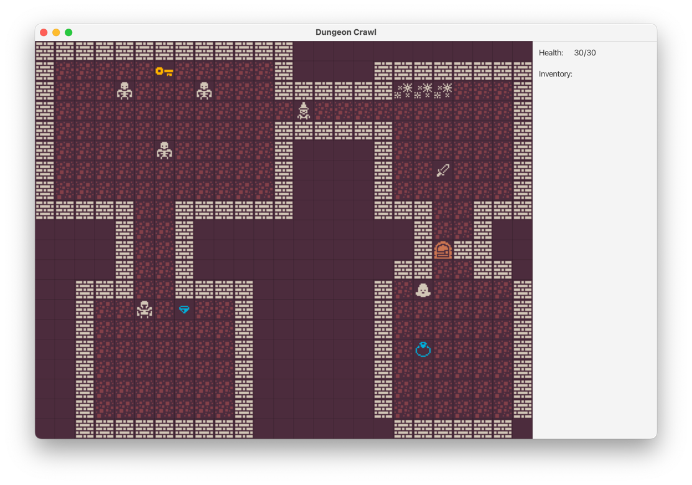

# Dungeon Crawler Game

[![GitHub Contributors][contributors-shield]][contributors-url]
[![GitHub Forks][forks-shield]][forks-url]
[![GitHub Stars][stars-shield]][stars-url]
[![GitHub Issues][issues-shield]][issues-url]

**Team Members:**

**VMAgost**  
[![LinkedIn][linkedin-shield]][linkedin-url-vmagost]

**idlewombat:**  
[![LinkedIn][linkedin-shield]][linkedin-url-idlewombat]

This repository contains a Dungeon Crawler-style video game developed as a team project using JavaFX. The game offers a retro, adventure-like gameplay where players explore dungeons, defeat enemies, and solve puzzles. While the game is considered complete, small updates and patches may be released.

## Table of Contents

- [Project Overview](#project-overview)
- [Features](#features)
- [Technology Stack](#technology-stack)
- [Installation Guide](#installation-guide)
  - [Prerequisites](#prerequisites)
  - [Installation Steps](#installation-steps)
- [How to Play](#how-to-play)
- [Built With](#built-with)

## Project Overview

The Dungeon Crawler Game is a Java-based application utilizing the JavaFX library for its graphical user interface. The game was developed as part of a team project at CodeCool, emphasizing teamwork and software design principles. It’s a fully playable demo with possible future updates.



## Features

- Explore a dungeon filled with various enemies and puzzles.
- Retro-inspired 2D pixel graphics.
- Simple and intuitive controls.
- Full-screen mode and adjustable resolutions.
- Save and load game progress.

## Technology Stack

- **Java**: Core programming language for game logic.
- **JavaFX**: Library for graphical interface and game visuals.
- **IntelliJ IDEA**: Primary development environment.
- **Git**: Version control for team collaboration.

## Installation Guide

### Prerequisites

Ensure you have the following installed:

- **Java Runtime Environment (JRE) 8 or higher**  
  Alternatively, **Java Development Kit (JDK) 16 or higher** is recommended for best compatibility.

### Installation Steps

1. **Download the game**  
   Download the latest release of the game from the [releases section](#).

2. **Extract the files**  
   Use a tool like **WinRAR** to extract the `.rar` file into a directory of your choice.

3. **Run the game**  
   Navigate to the folder where you extracted the files and double-click the `JAR` file to start the game.

   ```bash
   java -jar DungeonCrawlerGame.jar
   ```

4. **Full-Screen Mode**  
   If you wish to toggle full-screen mode, press `F11` or `Alt + Enter` during gameplay.

## How to Play

After installation:

- Double-click the JAR file to launch the game.
- Use the in-game instructions and help menu to learn more about the controls and objectives.
- If you need to exit the game, press `Q` or close the window manually.
- In-game controls are displayed in the top-right corner of the window.


## Built With

[![Java][java-shield]][java-url]
[![JavaFX][javafx-shield]][javafx-url]
[![IntelliJ][intellij-shield]][intellij-url]

---

[contributors-shield]: https://img.shields.io/github/contributors/VMAgost/DungeonCrawler
[contributors-url]: https://github.com/VMAgost/DungeonCrawler/graphs/contributors

[forks-shield]: https://img.shields.io/github/forks/VMAgost/DungeonCrawler?style=social
[forks-url]: https://github.com/VMAgost/DungeonCrawler/network/members

[stars-shield]: https://img.shields.io/github/stars/VMAgost/DungeonCrawler?style=social
[stars-url]: https://github.com/VMAgost/DungeonCrawler/stargazers

[issues-shield]: https://img.shields.io/github/issues/VMAgost/DungeonCrawler
[issues-url]: https://github.com/VMAgost/DungeonCrawler/issues

[linkedin-shield]: https://img.shields.io/badge/LinkedIn-0077B5?style=for-the-badge&logo=linkedin&logoColor=white
[linkedin-url-vmagost]: https://www.linkedin.com/in/vmagost/
[linkedin-url-idlewombat]: https://www.linkedin.com/in/bence-futasz/

[java-shield]: https://img.shields.io/badge/Java-ED8B00?style=for-the-badge&logo=openjdk&logoColor=white
[java-url]: https://www.java.com/en/

[javafx-shield]: https://img.shields.io/badge/JavaFX-0077B5?style=for-the-badge&logo=javafx&logoColor=white
[javafx-url]: https://openjfx.io/

[intellij-shield]: https://img.shields.io/badge/IntelliJ_IDEA-000000.svg?style=for-the-badge&logo=intellij-idea&logoColor=white
[intellij-url]: https://www.jetbrains.com/idea/

